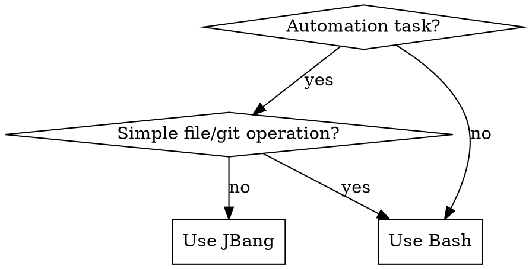

# Prefer JBang for Automation

## Overview

**Prefer jbang scripts over bash commands for automation tasks.**

While bash+jq/curl/awk work, jbang provides type safety, better debugging, IDE support, and maintainability. The slight overhead is worth it.

## Red Flags - STOP and Use JBang Instead

If you're thinking any of these, STOP and write a jbang script instead:

- "I'll use `jq` to parse this JSON"
- "A quick `curl | jq` pipeline will work"
- "Let me use `sed` or `awk` to transform this"
- "Bash loop with grep/sed will handle this"
- "This is a simple one-liner"
- "jq is purpose-built for JSON"

**All of these mean: Write a jbang script instead.**

## When to Use JBang vs Bash



**Use JBang for:**
- JSON/XML parsing and transformation
- REST API calls and processing
- Data extraction and formatting
- Multi-step file processing
- Anything requiring logic beyond simple filters
- Scripts you might need to debug or extend

**Still use Bash for:**
- Git commands (`git status`, `git commit`)
- Simple file operations (`ls`, `cp`, `mv`)
- System tools (`chmod`, `mkdir`)
- One-off glue commands

## Quick Reference

| Task | ❌ Avoid | ✅ Prefer |
|------|---------|----------|
| Parse JSON API | `curl \| jq` | `jbang script.java` with Jackson/Gson |
| Extract from JSON file | `jq '.users[] \| select'` | JBang with type-safe POJOs |
| Transform data | `sed \| awk` pipeline | JBang with clear logic |
| Multiple file processing | Bash loops | JBang with Java NIO |

## JBang Examples

### JSON Processing
```java
///usr/bin/env jbang "$0" "$@" ; exit $?
//DEPS com.google.code.gson:gson:2.10.1

import com.google.gson.*;
import java.nio.file.*;

public class ExtractEmails {
    record User(String name, String email, int age) {}
    record UserData(User[] users) {}

    public static void main(String[] args) throws Exception {
        var json = Files.readString(Path.of(args[0]));
        var data = new Gson().fromJson(json, UserData.class);

        for (var user : data.users) {
            if (user.age > 30) {
                System.out.println(user.email);
            }
        }
    }
}
```

Run: `jbang ExtractEmails.java users.json > emails.txt`

**Benefits over jq:**
- Type safety (compile errors if structure changes)
- IDE autocomplete and debugging
- Clear variable names and logic
- Easy to extend (add validation, error handling)

### API Calls
```java
///usr/bin/env jbang "$0" "$@" ; exit $?
//DEPS com.google.code.gson:gson:2.10.1

import com.google.gson.*;
import java.net.http.*;
import java.net.URI;
import java.time.*;
import java.time.format.*;

public class GithubRelease {
    record Release(String tag_name, String published_at) {}

    public static void main(String[] args) throws Exception {
        var client = HttpClient.newHttpClient();
        var request = HttpRequest.newBuilder()
            .uri(URI.create("https://api.github.com/repos/jbangdev/jbang/releases/latest"))
            .build();

        var response = client.send(request, HttpResponse.BodyHandlers.ofString());
        var release = new Gson().fromJson(response.body(), Release.class);

        var published = Instant.parse(release.published_at);
        var formatter = DateTimeFormatter.ofPattern("MMMM dd, yyyy 'at' HH:mm 'UTC'");

        System.out.println("Latest jbang Release Report");
        System.out.println("----------------------------");
        System.out.println("Tag: " + release.tag_name);
        System.out.println("Published: " + formatter.format(published.atZone(ZoneOffset.UTC)));
    }
}
```

Run: `jbang GithubRelease.java`

**Benefits over curl+jq:**
- Built-in HTTP client (no curl dependency)
- Type-safe date handling
- Readable formatting logic
- Easy to add headers, auth, error handling

## Common Rationalizations

| Excuse | Reality |
|--------|---------|
| "jq is purpose-built for JSON" | JBang with Gson/Jackson is MORE purpose-built - type-safe, debuggable |
| "Single command is simpler" | JBang scripts are just as easy: `jbang script.java args` |
| "jq/curl are standard tools" | JBang is standard for Java devs, more maintainable long-term |
| "Bash is more efficient" | Slight overhead is worth type safety and debugging |
| "This is just a quick script" | Quick scripts become production code - start with quality |
| "I don't need type safety" | You discover you need it when the API changes |
| "I can solve this directly with jq" | You're trading short-term convenience for long-term pain |
| "jq is efficient for single operations" | JBang is efficient AND maintainable |
| "WebFetch + jq is simple" | JBang HttpClient is simpler and type-safe |
| "Minimizes tool calls" | JBang minimizes debugging time and maintenance burden |

## Pattern: Creating JBang Scripts

1. **Create file** with `.java` extension
2. **Add shebang**: `///usr/bin/env jbang "$0" "$@" ; exit $?`
3. **Add deps**: `//DEPS group:artifact:version`
4. **Write code**: Regular Java with `main()` method
5. **Run**: `jbang ScriptName.java args`

**No compilation step needed** - jbang handles it transparently.

## When Bash is Still Right

Don't overdo it. These stay in Bash:
- `git status && git diff`
- `mkdir -p dir && cd dir`
- `chmod +x script.sh`
- Calling system tools: `gh pr create`, `docker run`

If the task is **invoking a tool**, use Bash.
If the task is **processing data or logic**, use JBang.
